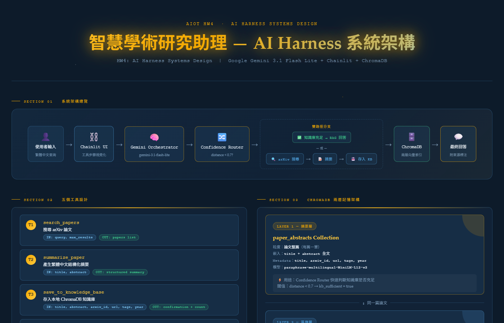
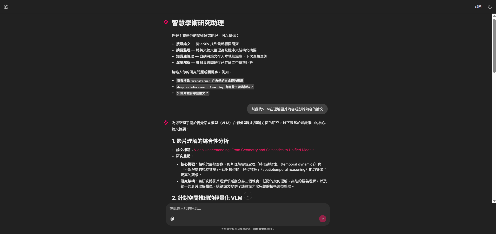
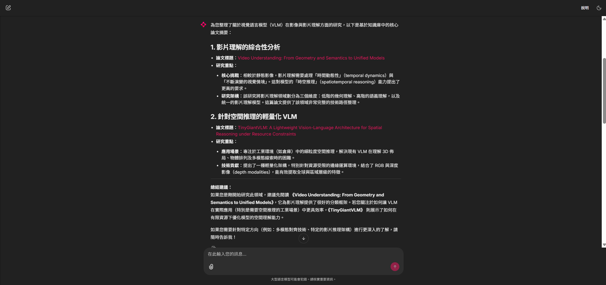

# 智慧學術研究助理 — AI Harness 系統

> **AIoT HW4：AI Harness Systems Design**  
> 碩士課程作業 · Academic Research Agent

---


## Live Demo

**線上 Demo：**  
 https://huggingface.co/spaces/Jnnnnnn/academic-research-agent

---

## 系統簡介

本系統以 **LLM as Controller** 架構實作一個智慧學術研究助理。使用者輸入研究問題，Google Gemini 作為 Orchestrator，自動決策並依序呼叫工具，完成「搜尋論文 → 中文摘要 → 存入知識庫 → RAG 查詢回答」的完整流程。

```
使用者問題
    │
    ▼
Gemini Orchestrator（Function Calling）
    │
    ├─ query_knowledge_base ──► ChromaDB（信心度路由）
    │       ├─ 已有資料 → 直接回答
    │       └─ 資料不足 ─────────────────────────────────┐
    │                                                     ▼
    ├─ search_papers ──────────────────────► arXiv API 搜尋
    ├─ summarize_paper ────────────────────► Gemini 中文摘要
    ├─ save_to_knowledge_base ─────────────► ChromaDB 存入
    └─ expand_context（選用）──────────────► 段落上下文擴展
```

---

## 技術棧

| 元件 | 技術 |
|------|------|
| LLM Orchestrator | Google Gemini `gemini-3.1-flash-lite` |
| 互動介面 | Chainlit 2.11 |
| 向量資料庫 | ChromaDB（兩層 RAG 架構） |
| 嵌入模型 | `paraphrase-multilingual-MiniLM-L12-v2` |
| 論文 API | arXiv（免費，無需金鑰） |
| 語言 | Python 3.11+ |

---

## 系統架構圖

[](https://Joxanne.github.io/AI-Harness_Academic-Research-Agent/infographic.html)

> 點擊圖片查看完整互動版（需啟用 GitHub Pages）

---

## 繳交項目

| 項目 | 檔案 | 狀態 |
|------|------|------|
| 書面報告 | [report.md](report.md) | ✅ |
| 系統架構資訊圖表 | [infographic.html](infographic.html) | ✅ |
| AI 輔助開發記錄 | [log.md](log.md) | ✅ |
| 實作程式碼 | [src/](src/) | ✅ |

---

## 專案結構

```
.
├── src/
│   ├── app.py                # Chainlit 入口（含相容性修補）
│   ├── agent.py              # Gemini Orchestrator + Function Calling 迴圈
│   ├── tools/
│   │   ├── arxiv_search.py   # Tool 1：搜尋 arXiv 論文
│   │   ├── summarizer.py     # Tool 2：產生繁體中文結構化摘要
│   │   ├── knowledge_base.py # Tool 3/4：存入 / 查詢 ChromaDB 知識庫
│   │   └── context_expander.py # Tool 5：擴展段落上下文（±1 chunk）
│   └── memory/
│       └── chroma_store.py   # ChromaDB 兩層封裝（摘要層 + 區塊層）
├── infographic.html          # 系統架構視覺化（純 HTML，可離線瀏覽）
├── report.md                 # 書面報告（中文）
├── log.md                    # AI 輔助開發對話記錄
├── requirements.txt          # Python 依賴
└── .env.example              # API 金鑰範本
```

---

## 快速啟動

### 1. 安裝依賴

```bash
python -m venv .venv
# Windows
.venv\Scripts\activate
# macOS / Linux
source .venv/bin/activate

pip install -r requirements.txt
```

### 2. 設定 API 金鑰

```bash
cp .env.example .env
# 編輯 .env，填入 GEMINI_API_KEY
```

```env
GEMINI_API_KEY=your_gemini_api_key_here
```

取得金鑰：[Google AI Studio](https://aistudio.google.com/app/apikey)（免費）

### 3. 啟動系統

```bash
chainlit run src/app.py
```

瀏覽器開啟 `http://localhost:8000`

---

## 使用範例

```
> 幫我搜尋 transformer 在自然語言處理的應用
> deep reinforcement learning 有哪些主要演算法？
> 知識庫裡有哪些論文？
> 請詳細說明 PPO 演算法的原理
```

---

## 五個工具說明

### Tool 1 — `search_papers`
- **功能：** 從 arXiv 搜尋相關論文
- **輸入：** `query`（搜尋關鍵字）、`max_results`（筆數）
- **輸出：** 論文列表（標題、摘要、URL、年份）

### Tool 2 — `summarize_paper`
- **功能：** 將英文論文摘要整理為繁體中文結構化摘要
- **輸入：** `title`、`abstract`
- **輸出：** 含研究問題、方法、貢獻、關鍵詞的中文摘要

### Tool 3 — `save_to_knowledge_base`
- **功能：** 將論文存入本地 ChromaDB 知識庫（兩層索引）
- **輸入：** 論文 metadata（標題、摘要、arXiv ID、URL、標籤、年份）
- **輸出：** 儲存確認訊息

### Tool 4 — `query_knowledge_base`
- **功能：** 對本地知識庫進行語意搜尋（RAG），回傳信心度指標
- **輸入：** `question`
- **輸出：** 相關論文、段落、`kb_sufficient`（是否足夠回答，信心度閾值 0.7）

### Tool 5 — `expand_context`
- **功能：** 針對特定段落，擷取前後 ±1 chunk 提供更完整上下文
- **輸入：** `arxiv_id`、`chunk_index`
- **輸出：** 擴展後的完整段落文字

---

## ChromaDB 兩層 RAG 架構

```
Layer 1 — paper_abstracts（摘要層）
  用途：整篇論文層級的語意搜尋 + 信心度路由
  單位：1 document = 1 論文

Layer 2 — paper_chunks（區塊層）
  用途：細粒度問答，300 字 chunks，50 字重疊
  單位：1 document = 1 段落

信心度路由：min_distance < 0.7 → kb_sufficient = True → 跳過 arXiv 搜尋
```

---

## Agent Workflow 決策流程

```
接收問題
    │
    ▼
query_knowledge_base(question)
    │
    ├─ kb_sufficient = True ──► 直接生成回答
    │
    └─ kb_sufficient = False
            │
            ▼
        search_papers(query, max_results=5)
            │
            ▼
        summarize_paper(title, abstract) × N
            │
            ▼
        save_to_knowledge_base(paper_data) × N
            │
            ▼
        生成完整回答（含來源引用）
```

---


### 系統截圖

| 歡迎介面 & 查詢輸入 | 論文摘要輸出結果 |
|:---:|:---:|
|  |  |

### 本機啟動

```bash
chainlit run src/app.py
# 瀏覽器開啟 http://localhost:8000
```

---

## 注意事項（Windows / Python 3.14 相容性）

本系統在 `src/app.py` 頂部套用兩個 monkey-patch，解決 Python 3.14 + Chainlit + uvicorn 的相容性問題：

1. **sniffio patch** — 修復 sniffio 在 uvicorn 空 context 任務中無法偵測 asyncio 的問題
2. **current_task patch** — 修復 `nest_asyncio` + Python 3.14 C builtin `current_task()` 在空 context 中回傳 `None` 的問題

---

## 評量對照

| 評量項目 | 對應內容 |
|----------|----------|
| AI 系統設計完整性（35%） | 完整 LLM+Tools+Memory 架構，report.md 詳述 |
| Tool / Orchestration 設計（25%） | 5 個工具 + Gemini Function Calling + 信心度路由 |
| Workflow 與邏輯清晰度（20%） | 決策樹明確，infographic.html 視覺化 |
| Infographic 視覺表達（10%） | infographic.html 五個 Section |
| log.md 設計過程記錄（10%） | log.md 含完整除錯與架構決策記錄 |
